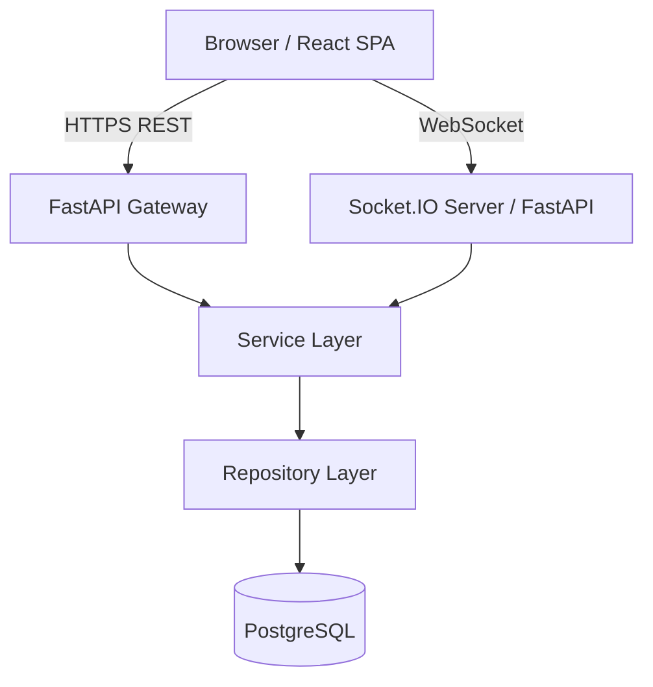

# System Architecture - Campus Delivery Hub

## 1. High-Level Architecture

The system is a modern full-stack web application contained in a monorepo. It features a React-based single-page application (SPA) on the frontend and a FastAPI backend serving a REST API and WebSockets. Data is persisted in PostgreSQL.

## 2. Frontend Architecture
- **Framework:** React + Vite + TypeScript.
- **Styling:** Tailwind CSS.
- **Routing:** React Router.
- **Data Fetching:** Axios.
- **State Management:** React Context / Custom Hooks (separation of server and client state).
- **Components:** Reusable UI components (Cards, Modals, Tables) in `src/components`.

## 3. Backend Architecture (FastAPI)
- **Framework:** Python 3.12+ with FastAPI and Uvicorn.
- **Structure:** Layered architecture (Router -> Schema -> Service -> Repository -> Database).
- **ORM:** SQLAlchemy 2.x with Alembic for migrations.
- **Validation:** Pydantic.
- **Real-time:** `python-socketio` mounted on the FastAPI app.

## 4. Flask Service Decision
A secondary Flask service is mentioned as an option for isolated tasks (e.g., admin reporting or background workers). Given the current requirements, introducing Flask would duplicate business logic (like Auth and ORM models) without significant architectural benefits. **Decision:** We will build the entire API using FastAPI. If heavy background processing is needed later, we will integrate Celery rather than a separate Flask API.

## 5. Security Model
- JWT stored securely in memory or HTTP-only cookies on the frontend (TBD based on standard).
- Bearer tokens for API auth.
- Dependency injection in FastAPI for route-level role authorization.
